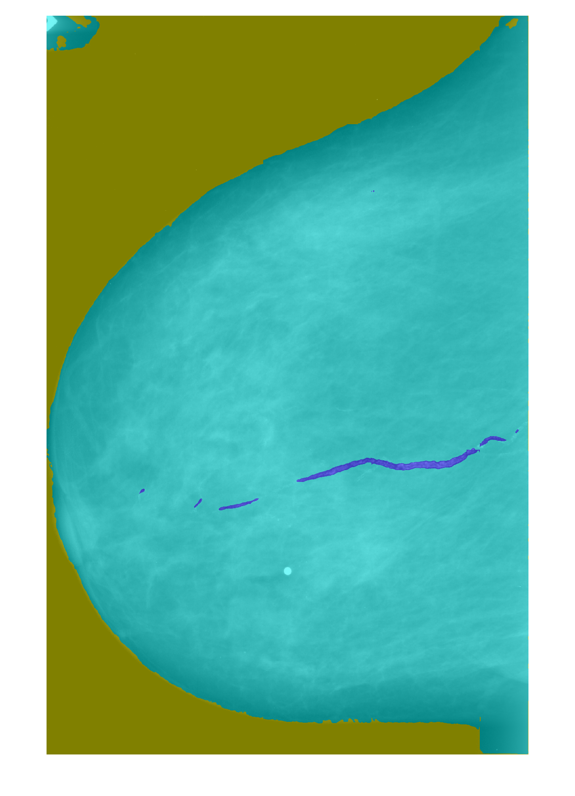

# bac-model-code

Trained models with initial parameters for classification, object detection and segmentation of breast arterial calcification on FFDM mammograms. Provided as MATLAB live scripts. The accompanying MATLAB code used to train the models is also included.

## Pre-processing

Images were pre-processed for the three models which entailed converting the DICOM images into 16-bit pngs and, for classification and object detection, cropping the images to the breast. For both steps we used code made available by [another study](https://github.com/nyukat/breast_cancer_classifier).

For demo purposes, a sample DICOM image with breast arterial calcification, `1-1.dcm`, from the [Cancer Imaging Archive](https://www.cancerimagingarchive.net/nbia-search/?CollectionCriteria=CBIS-DDSM) is included. Its original file location is: \CBIS-DDSM\Calc-Test_P_00646_LEFT_CC\08-29-2017-DDSM-NA-04488\1.000000-full mammogram images-68505.

### DICOM to 16-bit png conversion

Convert DICOM image to 16-bit png using [Pydicom](https://pydicom.github.io/). The bit-depth is set to 16 as that is the bit-depth of the demo image.

````python
import os
import png
import pydicom

def save_dicom_image_as_png(dicom_filename, png_filename, bitdepth=16):
    """
    Save 12-bit mammogram from dicom as rescaled 16-bit png file.
    :param dicom_filename: path to input dicom file.
    :param png_filename: path to output png file.
    :param bitdepth: bit depth of the input image. Set it to 12 for 12-bit mammograms.
    """
    image = pydicom.read_file(dicom_filename).pixel_array
    with open(png_filename, 'wb') as myFile:
        writer = png.Writer(
            height=image.shape[0],
            width=image.shape[1],
            bitdepth=bitdepth,
            greyscale=True
        )
    writer.write(myFile, image.tolist())
````
### Crop image

Crop converted image using code from [Wu et al (2019)](https://github.com/nyukat/breast_cancer_classifier):

````python
single_crop.crop_single_mammogram(os.path.join(r, file), # input mammogram_path
                "NO", # horizontal_flip
                view, # view, for the demo image this is 'L-CC'
                file, # cropped_mammogram_path
                'cropped_metadata.pkl', # metadata_path
                100, # num_iterations
                50) # buffer_size
````
| Converted Test Image           | Cropped Test Image            |
| ---------------------- | ---------------------- |
|  |  |

## Segmentation

To try the segmentation network, run the MATLAB live script to create the layer graph, `lgraph`. Assemble the network from the pre-trained layers:
````MATLAB
net = assembleNetwork(lgraph);
````
Convert the cropped image to RGB:
````MATLAB
imagePath = fullfile('croppedImage1-1.png');
grayImage = imread(imagePath);
rgbImage = cat(3, grayImage, grayImage, grayImage);

imwrite(rgbImage, strrep(imagePath,'.png','.tif'),"tif");
````
Read in the cropped tif and apply the segmentation network:
````MATLAB
im = imread('croppedImage1-1.tif');
figure
imshow(im)

segmentedImage = segmentImagePatchwise(im, net, [512 512]);

seg = labeloverlay(im,segmentedImage);
figure
imshow(seg);

% segmentImagePatchwise performs patchwise semantic segmentation on the input image
% using the provided network.
%
%  OUT = segmentImagePatchwise(IM, NET, PATCHSIZE) returns a semantically 
%  segmented image, segmented using the network NET. The segmentation is
%  performed patches-wise on patches of size PATCHSIZE.
%  PATCHSIZE is 1x2 vector holding [WIDTH HEIGHT] of the patch.

function out = segmentImagePatchwise(im, net, patchSize)

[height, width, nChannel] = size(im);
patch = zeros([patchSize, nChannel], 'like', im);

% pad image to have dimensions as multiples of patchSize
padSize(1) = patchSize(1) - mod(height, patchSize(1));
padSize(2) = patchSize(2) - mod(width, patchSize(2));

im_pad = padarray (im, padSize, 0, 'post');
[height_pad, width_pad, ~] = size(im_pad);

out = zeros([size(im_pad,1), size(im_pad,2)], 'uint8');

for i = 1:patchSize(1):height_pad
    for j =1:patchSize(2):width_pad
        patch = im_pad(i:i+patchSize(1)-1, j:j+patchSize(2)-1, :);
        patch_seg = semanticseg(patch, net, 'outputtype', 'uint8');
        out(i:i+patchSize(1)-1, j:j+patchSize(2)-1) = patch_seg;
    end
end

% Remove the padding
out = out(1:height, 1:width);

end

````
The network predicts for three classes: BAC, background and breast tissue:
|Test Image           | Prediction            |
| ---------------------- | ---------------------- |
|  |  |


